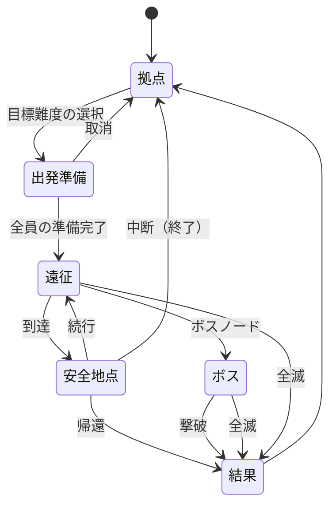
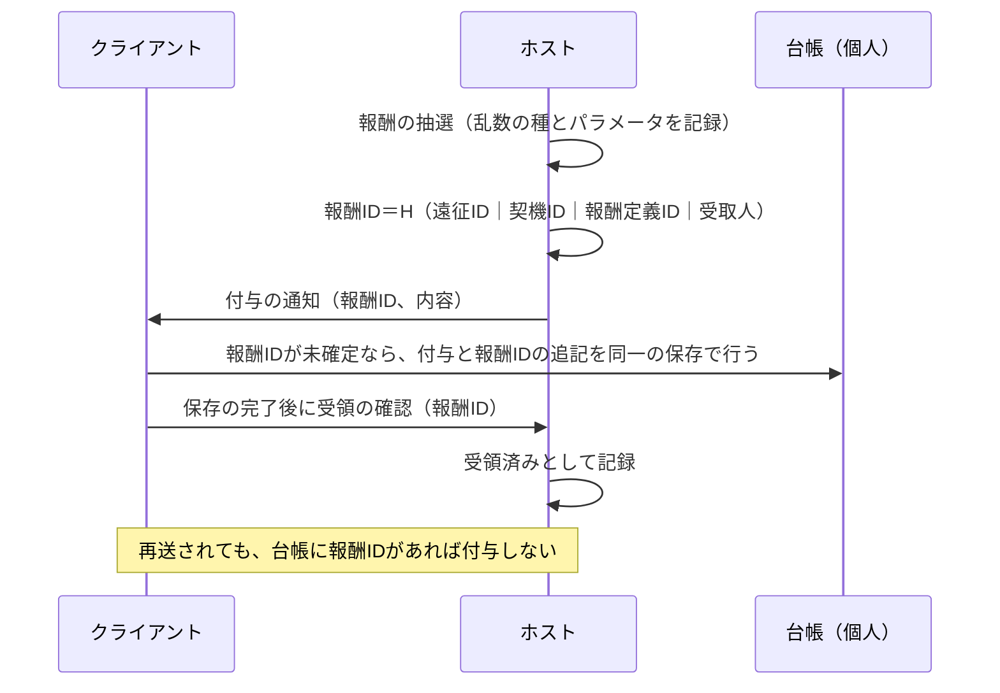

# 付録C  仕様の骨格

[← 計画書に戻る](../README.md)

本付録は、保存、協力同期、報酬確定、性能予算の**仕様の骨格**を示す。ゲーム本体のAPIと通信の仕組みは未確認であるため、ここでは「何を保証するか」を定め、「どう実現するか」は技術試作（段階0・1）で決める。形式の例は説明用であり、実装で確定する。

| 節 | 内容 |
| --- | --- |
| C1 | 部屋と遠征の状態遷移 |
| C2 | 保存の形式と書き込み手順 |
| C3 | データ定義とID |
| C4 | 報酬の確定 |
| C5 | 同期の責任とメッセージ |
| C6 | 異常時の挙動 |
| C7 | 性能の測定 |

## C1  部屋と遠征の状態遷移



| 状態 | 新規参加 | 再接続 | 保存 | 備考 |
| --- | --- | --- | --- | --- |
| 拠点 | 可 | 可 | 恒久データの保存 | 整理、製作、専門化の再配分 |
| 出発準備 | 可（準備の取消後） | 可 | なし | 全員の装備、危険度、狙い系統を確認 |
| 遠征（ノードの途中） | 不可 | 既存の参加者のみ | なし（確定済みの報酬の台帳のみ更新） | 切断の猶予90秒 |
| 安全地点 | 可 | 可 | 到達時に遠征の状態を必ず保存 | 確保が確定する。中断は、保存済みの安全地点から再開できる終了の操作 |
| ボス | 不可 | 既存の参加者のみ | なし | 敗北後の再開は安全地点から |
| 結果 | 不可 | 可 | 結果と台帳を保存 | 確定済みの結果を再表示 |

## C2  保存の形式と書き込み手順

### 配置

プロフィールごとに、本体のデータとは別の場所に保存する（場所は技術試作で確定する）。

```
<MOD保存領域>/
  <プロフィールID>/
    profile.json          恒久・個人（装備台帳、素材、専門化、研究、図鑑、地域進行）
    ledger.json           報酬の確定履歴（再送の重複防止）
    lostfound.json        遺失物（未確保の装備。上限10個）
    expedition.json       安全地点に到達するたびに保存する遠征の状態（遠征の終了時に削除）
    backups/
      profile.1.json ～ profile.3.json   直近3世代
    quarantine/           読み込めなかったデータ
```

### profile.json の骨格（例）

```json
{
  "format": 1,
  "dataVersion": "1.0.0",
  "modVersion": "1.0.0",
  "gameBuild": "（対象版を記録）",
  "profileId": "…",
  "revision": 17,
  "savedAt": "2026-10-01T12:00:00Z",
  "checksum": "sha256:…",
  "characters": {
    "blade": {
      "specialization": { "points": 18, "nodes": ["sod:spec/blade/counter/b1", "…"], "mark": "sod:spec/blade/counter/t" },
      "presets": { "equipment": [], "specialization": [] },
      "firstClears": ["region1"]
    }
  },
  "equipment": [
    {
      "uid": "e-000123",
      "def": "sod:item/weapon/chain_sword",
      "rarity": "rare",
      "ilvl": 14,
      "enhance": 2,
      "traits": [{ "id": "sod:trait/atk_pct", "value": 8.4 }, { "id": "sod:trait/atk_speed_pct", "value": 5.1 }, { "id": "sod:trait/crit_rate", "value": 3.6 }],
      "retunes": 1,
      "locked": false
    }
  ],
  "materials": { "shards": 340, "line_attack": 12, "line_guard": 4, "line_resonance": 2, "seal": 5, "tuning": 1 },
  "research": ["explore/1", "craft/1"],
  "codex": { "found": ["…"], "combos": ["…"] },
  "progress": { "regions": { "region1": { "bossFirstClear": true } }, "quests": [] },
  "pity": { "epicBossKills": 3 }
}
```

- 装備は**個体のID（uid）と定義のID（def）を分ける**。定義が将来変わっても、個体の値と履歴が残る。
- 装着中の装備は、台帳（equipment）への参照で表す。獲得済みの使用権や研究成果と、実際に今回装着している個体は別のデータとする。
- revisionは保存のたびに1ずつ増やし、古いファイルへの巻戻りの検出に使う。
- 版は、保存形式（format）、データ定義（dataVersion）、MODの版、ゲームの版を別々に記録する。

### 書き込みの手順

1. 保存内容をメモリ上で組み立て、整合性の検査（上限、参照）を行う。
2. 検査値（sha256）を付けて一時ファイルへ書く。
3. 一時ファイルを読み戻し、検査値を確かめる。
4. 現在のファイルをbackups/へ**コピー**する（現在のファイルは残す）。
5. 一時ファイルを現在のファイルに**置換**する。成功したら古い世代を削除する（3世代を保つ）。
6. いずれかで失敗したら、現在のファイルを変更せず、失敗を表示する。

### 読み込みの手順

1. 検査値を確かめる。本体とバックアップを検証し、有効なもののうち**revisionが最大のもの**を読む。**一時ファイルは読まない**（保存の確定点は置換の完了であり、確定前の内容を読むと、受領の確認を返していない付与を「あった」ことにして、後の書き込みの失敗で失うため）。古いファイルへの巻戻りは、revisionの減少で検出する。
2. 版が新しすぎる場合はロードを止める。古い場合は移行する。
3. データ定義の検証（重複ID、参照切れ、上限外の値）を行う。
4. 不明な効果、存在しない装備、上限外の値は、**黙って別物に置き換えず**、quarantine/へ隔離して表示する。
5. すべて失敗した場合は、ロードを止め、復旧の手順（バックアップの場所と手順）を表示する。

### 移行

- 元のデータは移行後も残す。移行前の版はbackups/pre-migration/に、直近3世代の回転とは別に保存し、自動では削除しない。
- 移行は版ごとの小さな段階（1→2、2→3）に分け、各段階を単体で試験する。
- 移行に失敗したらロードを止め、元のデータを変更しない。

### MODを外した時

- 本体のデータを書き換えない。MODの保存領域は独立しているので、MODを外しても本体は壊れない。
- 能力補正は保存せず、起動時にデータから再構築する。そのため、MODを外したあとに補正が残留しない。

## C3  データ定義とID

- IDは、名前空間付きの文字列とする。例：`sod:item/weapon/chain_sword`、`sod:trait/atk_pct`、`sod:spec/blade/counter/b1`。
- IDは**表示名や配列の順番に依存しない**。名前を変えてもIDは変えない。
- 定義はデータ（JSONなど）で持ち、起動時に検証する。

| 検証 | 内容 |
| --- | --- |
| 重複ID | 同じIDが複数ないか |
| 参照切れ | 存在しない装備、特性、状態への参照がないか |
| 上限 | 補正が第7章の層の上限に収まるか |
| タグ | 十のタグ以外がないか |
| 説明 | 短い説明と詳細説明が、同じデータから生成されるか |
| 世代 | 世代の上限の例外（夢食いの牙）が明示されているか |

## C4  報酬の確定

報酬は、誰に何が確定したかを**ホストが一元的に決め**、同じ処理が再送されても二重に受け取れないようにする。



- **抽選の確定と獲得処理を分ける**。抽選の結果は、再現に必要な情報（乱数の種、パラメータ、救済のk）とともに記録する。
- 報酬IDは、遠征ID、契機（報酬を起こした出来事）、報酬の定義、受取人のハッシュとする。**同じ出来事と同じ受取人からは、何回呼んでも同じIDが出る**ことが重複排除の核になる（連番は使わない）。
- **確定の点はクライアントの保存完了**とする。ホストは「送った」ではなく、受領の確認を受けた時に閉じる。ホストは確認を受けるまで未配布の一覧から再送する。
- 付与と確定済みIDの追記は**同一の保存**で行い、片方だけが書かれる状態を作らない。
- ホスト自身の取り分も同じ経路で処理し、特別扱いしない。
- 付与は、台帳に報酬IDがなければ行い、あれば無視する（冪等）。
- 台帳は遠征の終了後に圧縮する（確定済みのIDのうち直近のものだけを残す）。
- 経験値と基礎報酬は、直近5秒の貢献者に配分する。装備は個人ごとに抽選する。

## C5  同期の責任とメッセージ

| 責任 | ホスト | クライアント |
| --- | --- | --- |
| 敵、報酬、成長の確定 | ○ | 要求のみ |
| 画面の演出、操作感のための予測 | — | ○（結果ではない） |
| 恒久データの保存 | — | 本人のプロフィールに保存 |
| 部屋の一時状態 | ○ | 表示のみ |

### メッセージ（概要）

| メッセージ | 向き | 内容 |
| --- | --- | --- |
| 参加要求 | C→H | MOD名、版、データ定義の版、設定、依存関係 |
| 参加の可否 | H→C | 許可または、不一致の理由 |
| 準備の状態 | C↔H | 装備、専門化、危険度、狙い系統の確認 |
| 出発の確定 | H→C | 遠征の乱数の種、ノードの地図 |
| ノードの進入 | H→C | ノードの内容 |
| 報酬の付与 | H→C | 報酬ID、内容 |
| 受領の確認 | C→H | 報酬ID |
| 確保の確定 | H→C | 安全地点の確保の内容 |
| 再接続の同期 | H→C | 確定済みの結果、現在のノード |
| 離脱の通知 | C→H | 理由 |

配送の方法は、ゲーム本体の通信の仕組みを確かめてから決める（技術試作）。JSON上書きの自動同期が、独自のC#状態や装備台帳まで保証するわけではない。

### 版の照合

参加要求の時に、MODの版、データ定義の版、設定の差を照合する。差があれば、参加を許可せず、どの項目が違うかを表示する。本体の版が違う場合も同様とする。

## C6  異常時の挙動

| 事象 | 挙動 |
| --- | --- |
| 切断（遠征中） | 90秒の猶予。キャラは無敵の待機状態。超えると離脱。確保済みの成果は保全 |
| 再接続 | 確定済みの結果を再表示し、報酬は再配布しない |
| ホスト終了 | 直近の確定成果（安全地点までの確保）を保全。安全地点から再開 |
| 保存失敗 | 現在のファイルを変更せず失敗を表示。再試行を促す |
| 検査値の不一致 | バックアップから復旧。復旧できなければ隔離して停止 |
| 版の不一致（参加） | 参加を許可せず理由を表示 |
| 不明な装備、効果 | 隔離して表示。黙って置き換えない |
| 全員が同時に切断 | 各自の確保分は保全。遠征は直前の安全地点から再開できる |
| 報酬の再送 | 台帳の報酬IDで無視し、受領の確認だけを返す |
| ホストが確定後、送信前に終了 | 取りこぼしが起こり得る。記録して通知し、再開しない。ホスト側の未配布一覧の保存を追加するかは、技術試作の判断（P5）で決める。**重複は即時に不合格、取りこぼしは件数を記録して許容範囲を決める**（別の指標として数える） |
| ホスト移行 | 初期は保証しない |

## C7  性能の測定

### 予算（設計値）

| 対象 | 上限 |
| --- | --- |
| プレイヤー1人あたりの召喚 | 6 |
| プレイヤー1人あたりのMOD発動イベント | 毎秒60（部屋で毎秒160） |
| 一つの対象に付く継続効果 | 40 |
| 遠征中の戦闘履歴 | 直近500件 |
| クライアントあたりのMOD由来の通信 | 平均30 KB/s |
| メモリの増加（60分の遠征） | 50 MB以内 |
| フレーム時間 | 平均は本体の基準を維持、99パーセンタイルの悪化を記録 |

### 測定の方法

- **描画とロジックを別々に測る**（表示を減らしても判定が増える場合を見逃さない）。
- 開始直後と長時間経過後を同じ場面で比べる。
- ソロ、2人、4人、および一般構成と発動回数の多い構成を別々に測る。
- 測るもの：フレーム時間（平均、99パーセンタイル）、イベントの数、召喚と継続効果の数、メモリ、通信量。
- 世代の上限と内部クールダウンを外した状態でも試験し、規則の効果を確かめる。
- 予算を超えた構成は、**機能追加の前に**設計を見直す（第19章）。
